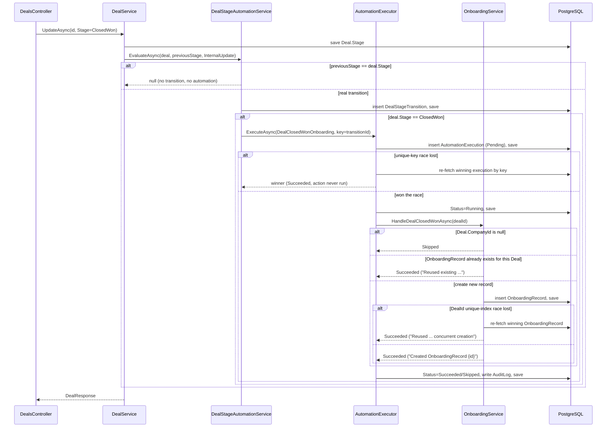
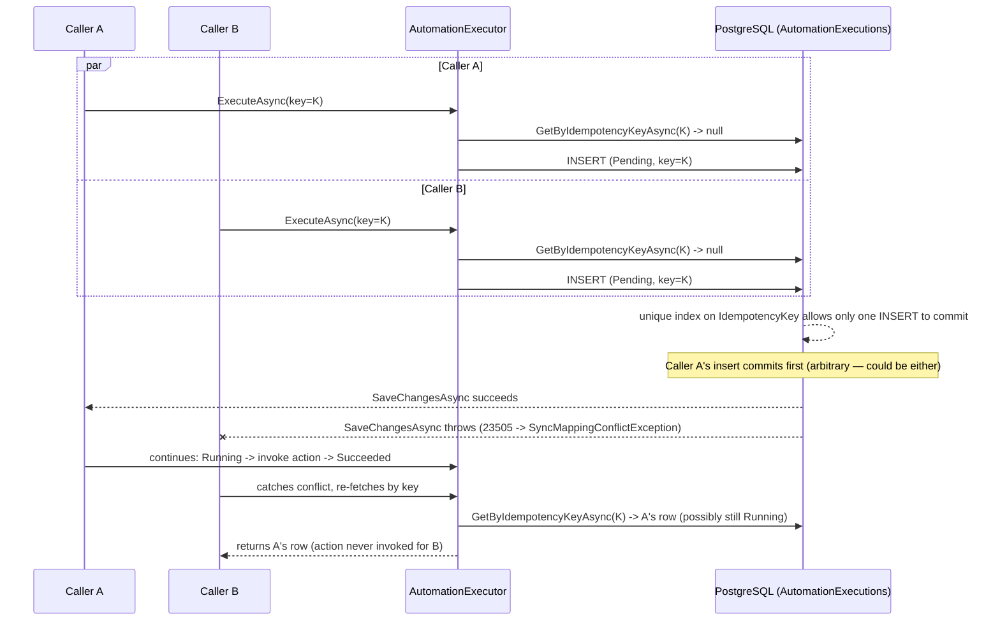

# Sales Workflow Automation

This document explains the Phase 6 sales automation pipeline built on top of Phase 4's
synchronization engine and Phase 5's webhook ingestion — it does not modify either, only hooks
into them (see `docs/SYNC_POLICY.md` and `docs/WEBHOOKS.md` for those engines themselves).

## What triggers automation

Two independent write paths both feed the same automation pipeline:

1. **HubSpot → Internal sync** (`DealSyncService`/`ContactSyncService`, Phase 4, invoked from a
   manual sync call or — once wired to a real webhook — Phase 5's event processor).
2. **Internal REST update** (`DealService`/`ContactService`, `PUT /api/deals/{id}` and
   `PUT /api/contacts/{id}`, and their `POST` create equivalents).

Both paths call the exact same `IDealStageAutomationService.EvaluateAsync` /
`IContactLifecycleAutomationService.EvaluateAsync` after their own save completes, passing the
previously-known stage and a `TransitionSource` (`HubSpotSync`, `HubSpotWebhook`, `InternalUpdate`,
or `ManualSync`) so the automation layer never has two implementations of the same logic to keep in
sync.

## Detecting stage transitions

`DealStageAutomationService.EvaluateAsync` only records a `DealStageTransition` when
`previousStage != deal.Stage`. This matters for two reasons:

- A create call always passes `previousStage: null`, so even a Deal created directly in
  `ClosedWon` is treated as a real transition (there is genuinely no prior stage) and does trigger
  onboarding.
- A no-op re-sync (HubSpot redelivers the same state, or an internal update that doesn't change
  `Stage`) must never fabricate a transition row or re-run automation. This is enforced by the
  equality check, not by deduplicating afterward.

`ContactLifecycleAutomationService` applies the identical rule to `Contact.LifecycleStage`.

## Automation execution persistence and idempotency

Every automation attempt (not just successful ones) is recorded as one `AutomationExecution` row:
`Pending -> Running -> Succeeded | Skipped | Failed`, mirroring Phase 4's `SyncJob` lifecycle and
built by the same kind of wrapper (`AutomationExecutor`, mirroring `SyncJobExecutor`) so business
services only implement their actual logic once.

Idempotency is enforced at two levels, deliberately:

1. **Application level**: `AutomationExecutor.ExecuteAsync` looks up `AutomationExecution` by
   `IdempotencyKey` first. If a terminal one (`Succeeded`/`Skipped`/`Failed`) already exists, the
   action is never invoked again — the existing row is returned unchanged.
2. **Database level**: `AutomationExecutions.IdempotencyKey` has a **unique index**. If two
   concurrent callers both pass the application-level check (a genuine race), only one `INSERT`
   wins; the other's `SaveChangesAsync` throws (translated to `SyncMappingConflictException` by the
   same `UnitOfWork` translation Phase 4 established — reused, not reimplemented), and the loser
   re-fetches and returns the winner's row instead of erroring or double-running the action.

**Idempotency key design**: `AutomationExecution.IdempotencyKey` is derived from
`DealStageTransition.Id` (e.g. `DealClosedWonOnboarding:{transitionId}`), not from `Deal.Id` alone.
This is intentional — see "Re-entering Closed Won" below for why a Deal can legitimately need more
than one `AutomationExecution` row over its lifetime.

## Closed Won → onboarding

When a `DealStageTransition` lands on `DealStage.ClosedWon`, `DealStageAutomationService` runs
`AutomationType.DealClosedWonOnboarding` via the executor, which calls
`OnboardingService.HandleDealClosedWonAsync`.

### Missing Company/Contact policy

`OnboardingRecord.CompanyId` is a required field (a pre-existing Phase 1 policy). A Closed Won
Deal with no `CompanyId` cannot get an onboarding record, and this is **not** treated as a failure:

- `OnboardingService` returns `AutomationStatus.Skipped` with a plain-English `ResultSummary`
  ("Deal has no associated Company; onboarding requires a Company.").
- Nothing is fabricated — no synthetic Company is created to force the record through.

`ContactId` is optional: a Closed Won Deal with a Company but no Contact still gets an
`OnboardingRecord` (with `ContactId = null`), since a primary Contact is a nice-to-have for
handoff, not a hard requirement the way Company is.

### Duplicate prevention (the real backstop)

`OnboardingRecords.DealId` has a **unique index** (this existed since Phase 1's schema, not added
in Phase 6). `OnboardingService.HandleDealClosedWonAsync`:

1. Checks `GetByDealIdAsync` first — if a record already exists, returns `Succeeded` with "Reused
   existing OnboardingRecord {id}" **without** invoking `AutomationExecutor`'s action a second
   time... except this check happens *inside* that very action, so more precisely: it's the first
   thing the action itself does.
2. If a concurrent caller wins the race to insert first, `SaveChangesAsync` throws
   `SyncMappingConflictException` (same DB-level translation as above); the loser re-fetches by
   `DealId` and returns the winner's row as `Succeeded`/"Reused existing OnboardingRecord {id}
   (concurrent creation)".

The `AutomationExecutions.IdempotencyKey` uniqueness (per-transition) and
`OnboardingRecords.DealId` uniqueness (per-deal, for the record's entire lifetime) are two
different constraints solving two different problems — see "Re-entering Closed Won" for why both
are needed.

### Re-entering Closed Won

A Deal can move `ClosedWon -> Negotiation -> ClosedWon` again (a mis-close corrected, or a genuine
re-negotiation). Each transition into `ClosedWon` gets its **own** `DealStageTransition` row and
its **own** `AutomationExecution` row (fresh idempotency key, since it's keyed by the new
transition's id) — this is deliberate audit-trail behavior: every business-meaningful event is
independently recorded, not silently absorbed into the first one.

What does **not** happen twice: the `OnboardingRecord`. The second `AutomationExecution` still
calls `HandleDealClosedWonAsync`, which finds the existing record via `GetByDealIdAsync` and
returns `Succeeded`/"Reused existing OnboardingRecord {id}" — verified live (see Phase 6 completion
report) with 2 `AutomationExecution` rows (both `Succeeded`) and exactly 1 `OnboardingRecord` for
the same Deal after `ClosedWon -> Negotiation -> ClosedWon`.

## Contact lifecycle automation

`ContactLifecycleAutomationService` records every real `LifecycleStage` transition
(`ContactLifecycleTransition`) and runs `AutomationType.ContactLifecycleTransition` through the
same executor for audit/idempotency consistency. Deliberately, **no side-effecting business
action** is attached to any specific lifecycle stage (no fabricated welcome email, marketing
campaign enrollment, or task creation) — the spec for this phase is explicit that inventing such
integrations would be out of scope. This gives a later phase a durable, already-idempotent hook to
attach real actions to, without redesigning this pipeline.

## Automation retry

`POST /api/automations/executions/{id}/retry` (`IAutomationRetryService`) manually re-runs a
**Failed** `AutomationExecution`. Like Phase 4's `ISyncJobRetryService`, it does not mutate the
original row — it builds a fresh idempotency key (`{originalKey}:retry:{newGuid}`) and invokes the
executor again, producing a new `AutomationExecution` row. The original Failed row is left exactly
as it was, so the full history (what failed, when, and what the retry did about it) stays visible.
Only `AutomationType.DealClosedWonOnboarding` supports retry today (it's the only automation type
with an idempotent, safely-repeatable action); retrying any other type or a non-Failed execution
returns a `DomainValidationException` (HTTP 400).

## Transaction boundaries

Automation runs **after** the triggering write's own `SaveChangesAsync` has committed the
authoritative entity state (the Deal's new Stage, the Contact's new LifecycleStage) — not inside
the same database transaction. This mirrors Phase 5's "process after durable persistence" boundary
and for the same reason: the entity's own state must never depend on whether the downstream
automation succeeds. A Deal correctly becomes `ClosedWon` even if `AutomationExecutor` later marks
the onboarding attempt `Failed` — the failure is visible and retryable, not silently lost, but it
never rolls back or blocks the Stage change itself.

## Failure behavior

If the automation action throws, `AutomationExecutor` catches it, marks the execution `Failed`,
stores a short `FailureCategory` (the exception's type name) and a truncated `ErrorMessage` (never
a raw payload, token, or stack trace), writes an `AuditLog` row, and returns normally — it does
**not** rethrow. A failed automation is therefore visible via
`GET /api/automations/executions` and retryable via the endpoint above, but it never surfaces as an
HTTP error on the triggering sync/update call, and it never blocks that call's own success
response.

## Inspection API

All endpoints below are documented as **temporarily unauthenticated**, matching the existing
posture of `SyncController`/`WebhooksController` — JWT bearer infrastructure exists but
`[Authorize]`/role-policy enforcement is Phase 8 scope.

```
GET  /api/automations/executions?limit=50        # recent AutomationExecutions, newest first
GET  /api/automations/executions/{id}
POST /api/automations/executions/{id}/retry       # manually retry a Failed execution
GET  /api/deals/{id}/stage-history                # full DealStageTransition history, oldest first
GET  /api/contacts/{id}/lifecycle-history         # full ContactLifecycleTransition history
GET  /api/onboarding?limit=50                     # recent OnboardingRecords, newest first
GET  /api/onboarding/{id}
```

## Sequence: internal REST update to Closed Won



## Sequence: automation idempotency under a concurrent race



## Security

No new credential, token, or secret handling was introduced. `AutomationExecution.ErrorMessage`
stores only `Exception.Message` (truncated to 500 chars) — never a stack trace, HTTP payload, or
`Authorization` header content, matching the same policy `SyncJob`/`IntegrationEvent` already
follow. All new inspection/retry endpoints are unauthenticated for now, consistent with every
other development-phase endpoint in this project (see the Security note above).
