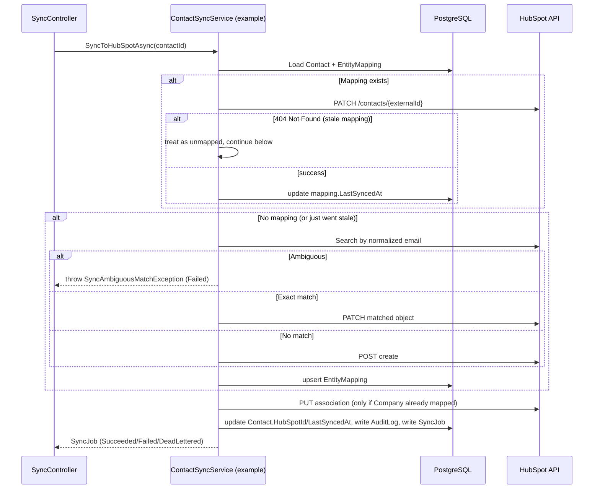
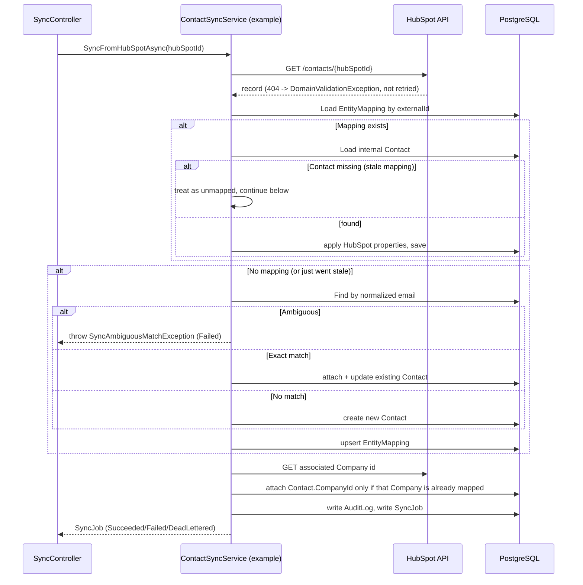

# Synchronization Policy

This document explains the conflict, retry, and consistency policy implemented by the Phase 4
synchronization engine (`src/CrmIntegration.Application/Sync/`), and is honest about what it does
*not* guarantee — there is no exactly-once delivery or atomic distributed transaction here, and
this document says so explicitly rather than implying otherwise.

## Conflict categories and how each is handled

| Category | Detection | Resolution |
|---|---|---|
| **Mapped update** | An `EntityMapping` already exists for the internal entity (or HubSpot object) | Update the mapped object/entity directly. Not a conflict — the normal path. |
| **Exact duplicate discovered before mapping** | No mapping exists yet, but a deterministic match (Contact email / Company domain) finds exactly one record on the other side | Reuse it: attach the mapping to the existing record and push/pull current data onto it, rather than creating a second record. |
| **Ambiguous duplicate** | A deterministic match finds more than one candidate (or, for Company, any name-only match) | **Refuse to guess.** Throws `SyncAmbiguousMatchException`; the `SyncJob` ends as `Failed` with `FailureCategory = "AmbiguousMatch"`. No record is created, updated, or merged. Resolving this requires a human (or a future phase) to disambiguate — never automatic. |
| **Remote object no longer exists** (stale mapping, HubSpot → 404 on an update) | `HubSpotNotFoundException` on an update through an existing mapping | The stale mapping is **not** treated as a permanent failure: the sync falls through to the create-or-match path as if unmapped, and the existing mapping row is updated in place with the new external id once a replacement exists. Contacts/Companies get a real safety net here (the email/domain match can reattach to a HubSpot record that already exists under a different id); Deals do not (see "Known limitation: Deals" below). |
| **Internal object no longer exists** (stale mapping, HubSpot → Internal direction) | The internal entity referenced by an existing mapping can't be found | Same recovery pattern as above, mirrored: treated as unmapped, a fresh internal-match-or-create runs, and the mapping is updated in place. |
| **Invalid field mapping** | HubSpot rejects a property value (`HubSpotBadRequestException`, 400) | Not retried (deterministic). `SyncJob` ends `Failed` with `FailureCategory = "BadRequest"`, carrying HubSpot's own validation message (truncated, no payload/token). |
| **Conflicting EntityMapping** | A concurrent sync would violate `EntityMappings`' uniqueness constraints (race condition) | Translated from a Postgres unique-violation into `SyncMappingConflictException` (see `UnitOfWork.SaveChangesAsync`) — surfaces as `Failed`/`MappingConflict`, HTTP 409. Not retried; a subsequent sync attempt will find the mapping the other request created and proceed normally. |

## Internal → HubSpot sync flow

## HubSpot → Internal sync flow

## Idempotency

Both flows above are safe to run repeatedly against the same entity:

- A second `Internal -> HubSpot` sync finds the `EntityMapping` from the first run and performs a
  `MappedUpdate`, not a create.
- A second `HubSpot -> Internal` sync finds the mapping by external id and updates the same
  internal row.
- Database uniqueness constraints (`EntityMappings` on `(EntityType, InternalId, ExternalSystem)`
  and `(EntityType, ExternalSystem, ExternalId)`) are the final backstop if application-level
  checks are ever bypassed by a race.

This is verified by tests named `*_IsIdempotent_*` in both the unit suite (fake HubSpot client)
and the integration suite (real PostgreSQL + fake HubSpot client), and by the live verification
test's explicit "sync again, verify no duplicate" step.

## Retry / backoff

Implemented in `HubSpotRetryExecutor`. Only three exception types are retried:
`HubSpotRateLimitedException`, `HubSpotServerException`, `HubSpotTransientException` — anything
else (400/401/403/404/409, validation, ambiguous match) is a deterministic failure and is never
retried.

- Bounded: `SyncRetryOptions.MaxAttempts` (default 4 total attempts).
- Exponential backoff: `BaseDelay * 2^(attempt-1)`, capped at `MaxDelay` (defaults: 2s base, 30s
  cap — approximating, not exactly reproducing, the illustrative 2s/5s/15s/30s sequence from the
  original spec, since a clean exponential formula is simpler to implement and reason about
  correctly than hand-picked steps).
- `HubSpotRateLimitedException.RetryAfter` (parsed from HubSpot's `Retry-After` header when
  present) overrides the computed backoff for that attempt.
- The **entire** sync action (mapping lookup, duplicate search, HubSpot call, persistence) is
  retried as one unit, not just the HTTP call — because the action re-checks `EntityMapping` and
  performs a fresh duplicate search on every attempt, retrying the whole thing is what makes
  "safe to run repeatedly" (idempotency) also cover "safe to run repeatedly after a partial
  failure" (see "Consistency" below).
- Every attempt is counted in `SyncJob.AttemptCount`.

## Dead-letter behavior

When a *retryable* failure exhausts `MaxAttempts`, the `SyncJob` is marked `DeadLettered` (not
`Failed` — that status is reserved for deterministic failures, which retrying would never fix).
`FailureCategory` and a truncated `ErrorMessage` are preserved; no token, secret, or full
request/response payload is ever stored.

`POST /api/sync/jobs/{id}/retry` (`ISyncJobRetryService`) manually re-runs a dead-lettered job. It
does **not** resume in place — it re-invokes the same entity/direction sync from scratch (reusing
the original job's `CorrelationId` so the two rows are easy to find together), because re-running
from scratch through the same idempotent path is exactly what makes the retry safe.

## Consistency: what this system does *not* guarantee

HubSpot's API and PostgreSQL cannot participate in one transaction — there is no way to make
"create the HubSpot object" and "write the EntityMapping row" atomic across a network boundary.
This system does **not** claim exactly-once delivery or distributed atomicity. What it does
instead:

- **Local DB failure after remote HubSpot success, for Contacts/Companies**: if creating a
  HubSpot Contact/Company succeeds but the subsequent `EntityMapping` write fails (e.g. a
  transient Postgres error), no mapping is persisted. The next sync attempt (retry or manual)
  finds no mapping, performs its normal duplicate search (by normalized email/domain), **finds
  the record that was already created**, and reuses it instead of creating a second one. This is
  a real, tested mitigation (`SyncToHubSpotAsync_ReusesExactHubSpotMatch_InsteadOfCreatingDuplicate`
  and the Company equivalent) — not a theoretical claim.

- **Known limitation: Deals.** The same failure mode for a Deal has no equivalent mitigation,
  because Deals deliberately have no safe deterministic dedupe key (see
  `docs/FIELD_MAPPING.md`). If a Deal is created in HubSpot but the local `EntityMapping` write
  then fails, a subsequent retry **will** create a second HubSpot deal — there is nothing to
  match against to detect the first one. This is an accepted, documented tradeoff: the
  alternative (dedupe deals by name) would risk silently merging genuinely different deals, which
  is worse. Mitigating this properly (e.g. an idempotency key HubSpot itself deduplicates on)
  would require a HubSpot capability this project doesn't rely on today, and is left as a
  candidate for a later phase.

- **At-least-once, not exactly-once**, is the honest characterization of this system's delivery
  guarantee for Contacts/Companies, and a best-effort (occasionally at-least-once-with-possible-
  duplication) characterization for Deals specifically.

## Correlation IDs

Every `SyncJob` carries a `CorrelationId` (from the caller's `X-Correlation-ID` header, or a
generated GUID if absent) and every `AuditLog` row written by the sync engine carries the same
value, so a single sync operation's job record, audit trail, and structured logs can all be
found together.
