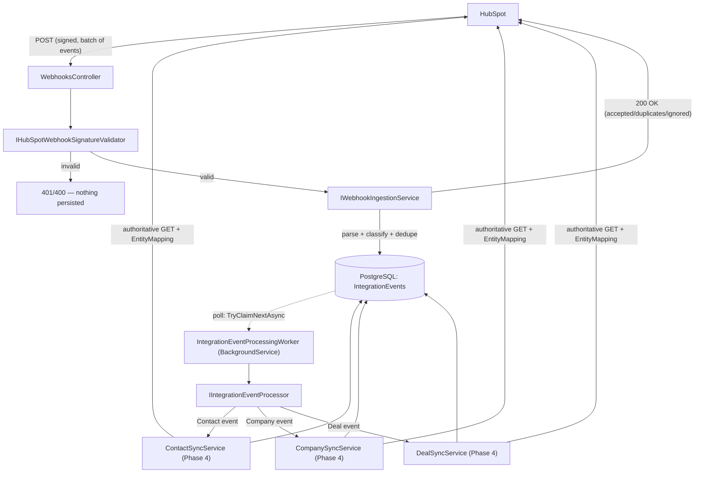

# Webhooks & Event Processing

Phase 5 adds durable ingestion of HubSpot webhook events and a background processor that feeds
them into the **Phase 4 synchronization engine** — no sync/mapping/duplicate-detection logic is
duplicated here; this phase only decides *when* to call Phase 4.

## Architecture



The webhook HTTP request only does steps up to "persist and acknowledge" — no Phase 4 sync
service is ever called from inside the request. Processing happens later, out-of-band, driven by
`IntegrationEventProcessingWorker` polling PostgreSQL.

## Signature verification

**Algorithm implemented: HubSpot webhook signature v3.** Verified directly against HubSpot's
current documentation during this phase (not assumed from memory) — see sources below.

- Headers: `X-HubSpot-Signature-v3` (the signature) and `X-HubSpot-Request-Timestamp`
  (milliseconds since epoch).
- Source string: UTF-8 `requestMethod (uppercase) + requestUri (full: scheme+host+path+query) +
  requestBody (raw, unparsed) + timestamp`.
- `HMAC-SHA256(sourceString, key = HubSpot:WebhookSigningSecret)`, **Base64**-encoded (not hex —
  v1/v2 use hex, which is the most common integration bug per HubSpot's own docs).
- Timestamp rejected if more than `Webhooks:MaxTimestampAge` (default 5 minutes, HubSpot's
  recommendation) away from the server's current time in either direction — this is the replay
  protection.
- Comparison is constant-time (`CryptographicOperations.FixedTimeEquals`), never a plain `==`.

**Why v3, not v1/v2**: v1/v2 are hex-encoded, have no timestamp, and provide no replay protection.
HubSpot's own docs describe v3 as "the latest and most secure version" and the one to use for
current apps; v1/v2 remain supported only for backwards compatibility with old integrations.

**Why the signing secret is `HubSpot:WebhookSigningSecret`, not `HubSpot:ClientSecret`**: this
project's `hubspot/` app uses static (private-app-token) authentication for CRM API access — see
`docs/DECISIONS.md`. That access token is entirely separate from the webhook signing secret shown
in the app's build settings. The two were already modeled as distinct config values from Phase 1;
Phase 5 just implements what reads `WebhookSigningSecret`. Neither this document nor any log line
ever contains the actual secret value.

Sources consulted: HubSpot's webhook validating-requests documentation and developer-platform
webhooks documentation (retrieved during this phase — see the Phase 5 completion report for the
exact URLs and what each confirmed).

## Webhook request lifecycle

1. `WebhooksController.ReceiveHubSpotWebhook` reads the raw body exactly as received (required
   for signature validation — no model binding, no re-serialization).
2. Signature validated using the *exact* method/URI/body/timestamp from the live request. Invalid
   → `401` with a `ProblemDetails` body naming the failure category (never the expected/received
   signature values) — nothing is persisted.
3. Valid → handed to `IWebhookIngestionService`, which parses the JSON array, classifies each
   event, and persists each one independently. Malformed JSON → `400`, still nothing persisted.
4. Response: `200 OK` with `{ correlationId, accepted, duplicates, ignored }` — always fast,
   since no Phase 4 sync call happens in this path.

## Supported events

HubSpot delivers batches of events shaped like
`{eventId, subscriptionType, objectId, propertyName, occurredAt, attemptNumber, ...}`
(`subscriptionType` examples: `contact.propertyChange`, `company.creation`, `deal.propertyChange`).

**Policy** (`WebhookSubscriptionTypeClassifier`): every syntactically valid event is **persisted**
(durability first — we always want a record of what HubSpot sent), but only `creation` and
`propertyChange` events for `contact`/`company`/`deal` are actually **processed**. Everything else
(deletions, privacy-deletion, other object types like tickets/conversations, association-only
events) is persisted with `Status = Ignored` and never queued for processing. This is a
deliberate simplification: Phase 4's sync services have no delete/association-only path yet, and
inventing one just to consume an event would be exactly the kind of premature complexity this
project avoids. An `Ignored` event is fully auditable (you can see HubSpot sent it) without
pretending it was acted on.

Robustness strategy: the webhook only tells us **that** something changed on a given
`objectId` — we never try to reconstruct a domain entity from the partial webhook payload.
Processing always calls the matching Phase 4 `SyncFromHubSpotAsync`, which fetches the
*authoritative current* HubSpot object and synchronizes that. This also means property-level
detail (`propertyName`/`propertyValue`) in the webhook is informational only, not applied
directly.

## Idempotency

`IntegrationEvent.ExternalEventId` = HubSpot's `eventId`, which HubSpot documents as the stable
identifier for one logical event — separate from `attemptNumber`, which counts *HubSpot's own*
redelivery attempts of that same event. (We rely on `eventId` staying constant across HubSpot's
retries; `attemptNumber` existing as a separate field is the signal that this separation is
intentional on HubSpot's side, but this is a documented assumption, not something we could verify
without triggering real HubSpot redeliveries — see "Known limitations".)

Enforced with a **database-level unique index** on `ExternalEventId` (`IntegrationEventConfiguration`),
not just an application check:
1. `IWebhookIngestionService` checks `ExistsAsync` first (fast path, avoids a failed insert in the
   common case).
2. `TryAddAsync` still attempts the insert regardless, and the unique constraint is the real
   backstop — a `23505` unique-violation is caught and treated as "duplicate," not an error. This
   is what makes concurrent duplicate deliveries safe (two requests racing past the `ExistsAsync`
   check can't both insert successfully).

## Batch behavior

HubSpot may deliver up to ~100 events in one HTTP POST as a JSON array. The signature is validated
**once** for the whole request body (HubSpot signs the entire raw body, not per-event). Each event
in the array is then parsed, classified, and persisted **independently** — one unsupported or
duplicate event in a batch does not affect any other event in the same batch. See
`WebhooksApiTests` for batch, duplicate-within-batch, and mixed-supported/unsupported coverage.

## IntegrationEvent lifecycle

```
Received → Processing → Processed
                       → Received (transient failure, attempts remain)
                       → Failed (deterministic failure — never retried)
                       → DeadLettered (transient failure, attempts exhausted)
Ignored (terminal, assigned at ingestion — never enters the processing pipeline)
```

## Event claiming / concurrency

`IIntegrationEventRepository.TryClaimNextAsync` picks the oldest `Received` row, then issues a
**single atomic `UPDATE ... WHERE Id = x AND Status = 'Received'`** (via EF Core's
`ExecuteUpdateAsync`) to flip it to `Processing`. If a concurrent worker already claimed it, this
affects 0 rows and the caller gets `null` back — no row lock, no `SELECT ... FOR UPDATE SKIP
LOCKED`, no distributed lock service. This is intentionally the simplest approach that's still
correct: the conditional `WHERE Status = 'Received'` makes the transition atomic at the database
level regardless of how many application instances are polling concurrently. Verified with a real
concurrency test (`TryClaimNextAsync_CannotClaimTheSameEventTwiceConcurrently`) against real
PostgreSQL: two separate `DbContext`s racing to claim the same row — exactly one succeeds.

## Durable processing

`IntegrationEventProcessingWorker` (a `BackgroundService`) polls PostgreSQL every
`Webhooks:PollingInterval` (default 5s), draining everything currently claimable before sleeping
again. PostgreSQL is the only durable state — the worker itself holds nothing that would be lost
on an application restart; it just asks the database "what's next" again. No in-memory queue, no
Kafka/RabbitMQ/Redis/Service Bus — exactly what the spec asked for and no more.

## Processor → Phase 4 integration

`IntegrationEventProcessor` does exactly one thing per event: look at `EntityType` and call the
matching Phase 4 service's `SyncFromHubSpotAsync(objectId, correlationId)` —
`ContactSyncService`/`CompanySyncService`/`DealSyncService`, unmodified from Phase 4. All mapping,
duplicate detection, association sync, and `EntityMapping` management happens inside those calls,
exactly as it did before Phase 5 existed. The processor only translates the `SyncJob` result back
into an `IntegrationEvent` status transition.

## Retry boundary (the two retry layers, and why they don't fight)

There are two independent, bounded retry mechanisms, and they solve different problems:

| Layer | Scope | Bound | Triggers on |
|---|---|---|---|
| Phase 4 (`HubSpotRetryExecutor`) | One call to a Phase 4 sync service | `SyncRetryOptions.MaxAttempts` (default 4), tight exponential backoff (seconds) | `HubSpotRateLimitedException`/`HubSpotServerException`/`HubSpotTransientException` |
| Phase 5 (`IntegrationEventProcessor`) | Repeated *processing passes* of one IntegrationEvent, spaced by the worker's poll interval | `Webhooks:MaxProcessingAttempts` (default 3) | A `SyncJob` that came back `DeadLettered` (i.e. Phase 4 already exhausted its own budget) |

By the time an `IntegrationEvent` processing attempt sees a failure, Phase 4 has **already**
retried transient HubSpot errors internally and either succeeded or given up
(`SyncJob.Status = DeadLettered`). Phase 5 never retries the same HTTP-level failure a second time
in a tight loop — it only decides whether it's worth trying the *whole* sync again after a real
amount of wall-clock time has passed (extended outages that outlast Phase 4's few-second backoff
window). A **deterministic** failure (Phase 4 throws rather than returning `DeadLettered` — e.g.
`HubSpotBadRequestException`, `SyncAmbiguousMatchException`) is never retried at either layer:
`IntegrationEventProcessor`'s outer `catch` marks it `Failed` on the first attempt.

## Dead-letter behavior

An `IntegrationEvent` becomes `DeadLettered` when a transient-failure `SyncJob` outcome recurs
`MaxProcessingAttempts` times. `FailureCategory` and a truncated (500-char) `LastError` are kept;
no token, secret, or Authorization header is ever stored (same convention as Phase 4's `SyncJob`).

## Manual replay

`POST /api/webhooks/events/{id}/retry` (`IIntegrationEventRetryService`) resets a `DeadLettered`
event to `Received` with `AttemptCount = 0` — a fresh budget, since a human explicitly decided to
retry. It does not work on events in any other status (`DomainValidationException` → `400`).

## Audit / correlation

Every webhook HTTP request gets a `CorrelationId` (from `X-Correlation-ID`, or a generated GUID),
which flows into the `IntegrationEvent` row, every structured log line
(`WebhookReceived`/`WebhookSignatureRejected`/`WebhookDuplicateDetected`/`WebhookEventPersisted`/
`WebhookUnsupportedEvent`/`WebhookEventClaimed`/`WebhookProcessingStarted`/
`WebhookProcessingSucceeded`/`WebhookProcessingFailed`/`WebhookDeadLettered`/
`WebhookRetryRequested`), and the `AuditLog` rows written at each terminal processing outcome —
reusing the exact `AuditLog` table and `IAuditLogRepository` Phase 4 already established, not a
new audit mechanism. Tracing "webhook → IntegrationEvent → SyncJob → EntityMapping" is possible by
following the shared `CorrelationId` across the `IntegrationEvents`, `SyncJobs`, and `AuditLogs`
tables.

## Security considerations

- The signing secret and access token are read from configuration only (`HubSpotOptions`) — never
  hardcoded, logged, or returned to a caller.
- Signature failures return a generic category (`SignatureMismatch`, `StaleTimestamp`, etc.), never
  the expected or received signature value.
- The raw signed request body is never logged in full — only its length (`WebhookReceived
  BodyLength=...`).
- `IntegrationEvent.Payload` stores the *parsed, normalized* event fields (eventId, subscriptionType,
  objectId, propertyName, occurredAt, attemptNumber) as JSON — not the raw HTTP request, headers,
  or Authorization. This is a deliberate minimization: it's exactly the information needed to
  audit/replay what HubSpot told us, with nothing beyond that.
- **Temporary, development-only exposure**: `GET /api/webhooks/events`, `GET
  /api/webhooks/events/{id}`, and `POST /api/webhooks/events/{id}/retry` have no authentication —
  JWT/RBAC enforcement is Phase 8 scope. The ingestion endpoint itself is protected by HubSpot's
  signature (an attacker without the signing secret cannot inject events), but the inspection/
  replay endpoints are not access-controlled at all yet. Do not expose this API outside a trusted
  local/development environment before Phase 8.

## Local testing

```
# Deterministic unit tests (fake HTTP, no network, no database)
dotnet test tests/CrmIntegration.UnitTests --filter FullyQualifiedName~Webhooks

# Integration tests (real PostgreSQL, fake HubSpot client — no internet access needed)
dotnet test tests/CrmIntegration.IntegrationTests --filter FullyQualifiedName~Webhooks
```

To manually POST a signed test webhook against a locally running API, compute the v3 signature
with the same algorithm as `HubSpotWebhookSignatureValidator` (see
`WebhooksApiTests.BuildSignedRequest` for a working reference implementation) using the
`HubSpot:WebhookSigningSecret` value from your local `.env`.

## Live verification status and limitations

**Not performed against a real live HubSpot webhook delivery**, and this report does not claim
otherwise. Specifically:

- The `hubspot/` app (private, static-auth) is confirmed installed in the connected dev account
  (`hs project app-install-status`), and `hs project validate` confirms the newly added
  `hubspot/src/app/webhooks/crm-changes-hsmeta.json` component is schema-valid.
- The component's `targetUrl` is a placeholder (`REPLACE-WITH-YOUR-DEPLOYED-API-HOST`) — this
  project was **not uploaded or deployed** (`hs project upload`/`deploy` were intentionally not
  run), because doing so would register a real webhook subscription pointing at a URL that
  doesn't resolve to anything from this sandboxed development environment (no publicly reachable
  HTTPS endpoint exists here, and installing tunneling software to create one was explicitly out
  of scope for this phase).
- Therefore: no real HubSpot webhook was ever received, and this document does not claim
  signature validation, ingestion, or processing were exercised against a genuine live delivery.
  What **was** verified: the v3 signature algorithm deterministically (unit tests reproducing
  HubSpot's documented algorithm byte-for-byte, including a body-mutation-invalidates-signature
  test), the full HTTP pipeline via `WebApplicationFactory` with self-computed valid/invalid
  signatures (integration tests), and the HubSpot project configuration's schema validity via the
  official `hs` CLI.
- To close this gap in a real environment: deploy the API to a real HTTPS endpoint, replace the
  placeholder `targetUrl`, run `hs project upload` and `hs project deploy`, then trigger a real
  Contact/Company/Deal change in the connected HubSpot test account and confirm an `IntegrationEvent`
  row appears.
